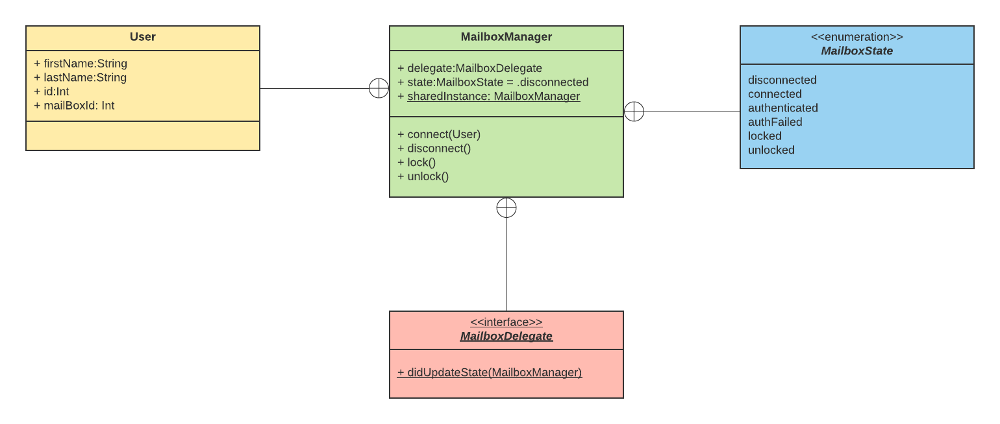

# mailboxAccess

Technical Assignment:

You’re part of a new and exciting project. The project will allow customers to track a package. Once it is delivered to your homes mailbox, you will be able to lock and unlock your mailbox with a mobile app - Assume your team also produced the hardware for the mailbox giving you full control. You will need to create the mobile app; your cloud infrastructure will be either AWS or Azure. Your application will use the mobile phones GPS for location and Bluetooth Low Energy (BLE) to control access to the mailbox.

1. Provide a structural UML class diagram of the mobile app (I.e. Classes, Interfaces, Components etc..)
2. Implement the the following functions as outlined by your UML diagram. Make any assumptions necessary - but please provide your assumptions, imports are not required. Please be specific to BLE and the OS of your choice (iOS or Android only).
 - Connect to a discovered Mailbox
 - Authenticate user
 - Send unlock command
 
 ---
  
 ## Assumptions
  - Only one mailbox is present in close proximity with the app. `MailboxManager` does not currently handle validating mailbox ids across multiple mailboxes.
  - The User JSON/object, is obtained as part of authentication with the 'cloud infrastructure'. Code/classes for that is not implemented in this repository.
  - The physical mailbox is BLE enabled. It is a bluetooth peripheral device that broadcasts its name in the advertisement packets which the iOS app can use to determine which devices are of interest.
  - The mailbox has a bluetooth service with 2 characteristics.
  - The 'mailbox id' characteristic contains the ID of the mailbox which should match the mailbox id also in the User object. 
  - The 'lock' characeristic can be written to which will cause the mailbox to be locked or unlocked.
  
  ## Relevant Classes
  Only BLE related classes implemented. UI classes eg login screen, and logic for communicating with backend is not included here.
   - `User`. User model object obtained as part of authentication with cloud.
   - `MailboxManager`. Singleton Manager class that manages BLE operations/tasks. Also has methods to lock/unlock the mailbox.
   - `MailboxState`. Enum for various states of MailboxManager. This is stored in the 'state' property of the `MailboxManager` object.
    - `disconnected`. Default state; not connected to mailbox.
    - `conntected`. Discovered and connected to mailbox.
    - `authenticated`. The mailbox id in the user profile (in User object) matches with the mailbox id. The app can proceed to lock/unlock the mailbox.
    - `authFailed`. The mailbox id in the user profile does NOT match with the mailbox id. The app cannot proceed to lock/unlock the mailbox.
    - `locked`. Locking the mailbox was successful.
    - `unlocked`. Unlocking the mailbox was successful.
   - `MailboxDelegate`. Delegate for MailboxManager. UI components can use this to keep track of the various states of the MailboxMnager and react as needed. There is a single method that will be called - `didUpdateState()`
   
  ## Flow
   1. App shows login screen and uses entered credentials to call the backend authentication API. If successful, a `User` object is returned.
   2. App calls `connect(User)`method of `MailboxManager` to connect to mailbox. The `User` object obtained earlier is passed in here.
   3. This triggers the whole chain of events:
    - scan for BLE advertisements, look for peripheral with the target name.
    - once the peripheral is discovered, discover it's service
    - once the service is discovered, discover it's characteristics
    - once the 'mbox id' characteristic is discovered, read it's value and verify that it matches the mbox id value in the `User` object. The success or failure of this check is communicated via the `didUpdateState()` method of the `MailboxDelegate`.
   4. If it is, the app can present a UI to allow the user to lock/unlock the mailbox. This is done using the `lock()` and `unlock()` methods of `MailboxManager`.
   5. If not, `MailboxManager` will disconnect from the mailbox device/peripheral.

  ## UML Diagram
  
